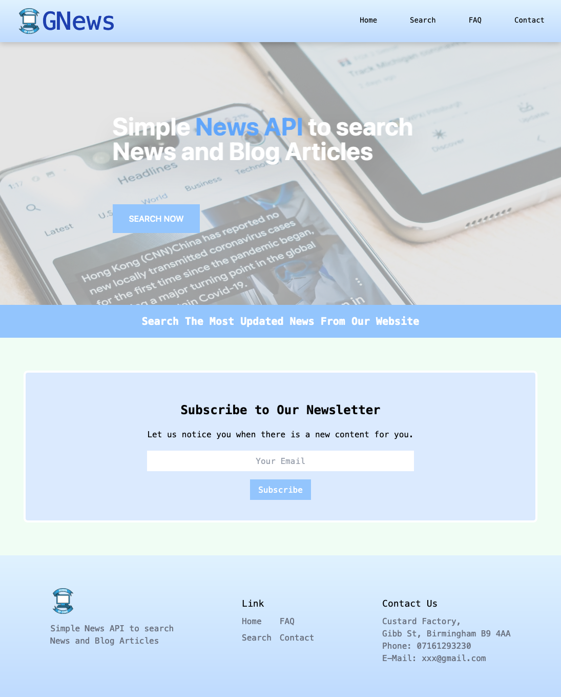
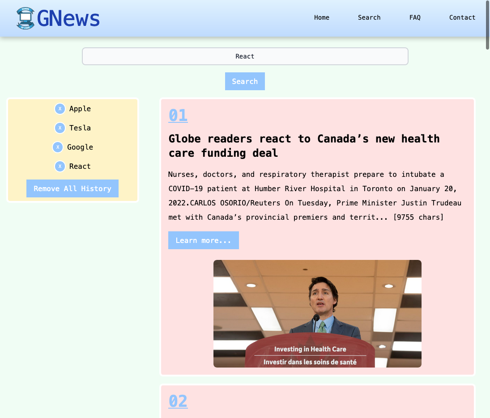
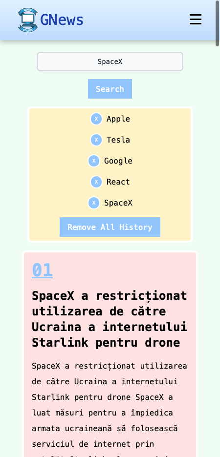

# Percayso Programming Exercise 3

## Table of contents

- [Overview](#overview)
  - [The challenge](#the-challenge)
  - [Screenshot](#screenshot)
  - [Links](#links)
- [My process](#my-process)
  - [Built with](#built-with)
  - [Continued development](#continued-development)
- [Brief](#brief)
- [Submitting your solution](#submitting-your-solution)
- [Extra credit](#extra-credit)

## Overview

### The challenge

- Use cookie to save user's search history in search page.

- A responsive navbar with functioning hamburger menu.

- Tailwindcss styling for all the pages and components.

- Mobile-first development for all the pages and components.

- Fetch data from gnews.io API

- Unit tests for components

### Screenshot

### Project demo link

- Live Site URL: [Live site URL here](https://gnews-app-marco.netlify.app)

## My process

### Built with

- React
- Tailwindcss
- Semantic HTML5 markup
- Flexbox
- Mobile-first workflow

### Continued development

- More sections can be added in the home page.
- The FAQ page and contact page can also be completed after the given time period.
- The search page in desktop version has a bit margin problem between history section and result section but it is not obvious, which can be improved when there is more time.
- The hamburger menu can only be closed when clicking on the menu. This can be corrected by adding JavaScript.
- More unit tests can be added.

## Brief

Create a website that gets news from the GNews api:

    https://gnews.io/?ref=apilist.fun

Your website must:

1. Include a search area
2. Include a results area
3. Include tests
4. Be hosted on a publicly accessible URL, so we can see it working

You are free to choose:

1. How to style all aspects of the page.
2. What language and framework to use.

We are looking to understand your approach to solving this problem as much as the actual technical solution. Add comments to your code to help us understand your thinking.

Googling syntax is allowed, googling solutions is not.

## Submitting your solution

Please commit your solution within the time frame given to you, even if your solution is not complete. We will be interested in seeing how you approached the problem.

## Extra credit

If you're in the mood for showboating, plese feel free to show us what else you can do. E.g. you could automate tests for your solution.
